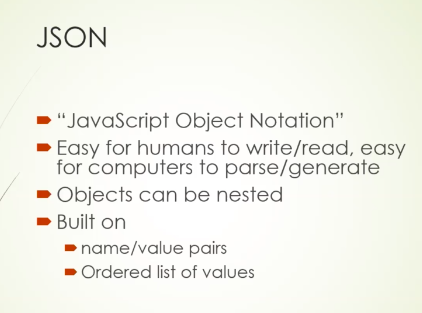
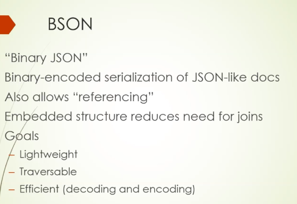

# mongodb 
## Info 

<ol> 
  <li> OpenSource NoSql Database </li>
  <li> Document Oriented NoSql  </li>
  <li> Written in C++ </li>
  <li> Initial release in Feb 2009 </li>
  <li> github.com/mongodb/mongo </li>
  <li> This was a NewYork based company name 10Gen which now changed as MongoDb Inc. </li>
  <li> IN the beggning Mongodb started as Platform service in Azure Platform in 2007 </li>
</ol>

## Sql VS Mongodb 

### Store data in the form of JSON 

## BSON 

### AT mongodb BSON was invented -- this is basically a computer data interchange format ..

