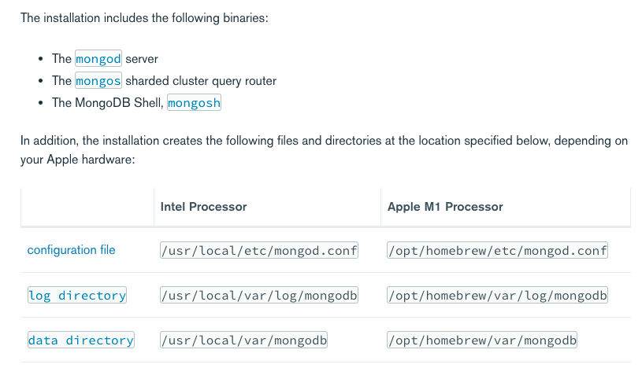

# mongodb

## Install MongoDb community addition 5.x on MAC OS

[Installation LInk] (https://docs.mongodb.com/manual/tutorial/install-mongodb-on-os-x/)

## Step 1

```
brew tap mongodb/brew
```

### step 2 

```
brew install mongodb-community@5.0
```

### step 3 configuration details 



### Step 4 starting mongodb service 

```
brew services start mongodb-community@5.0
```

